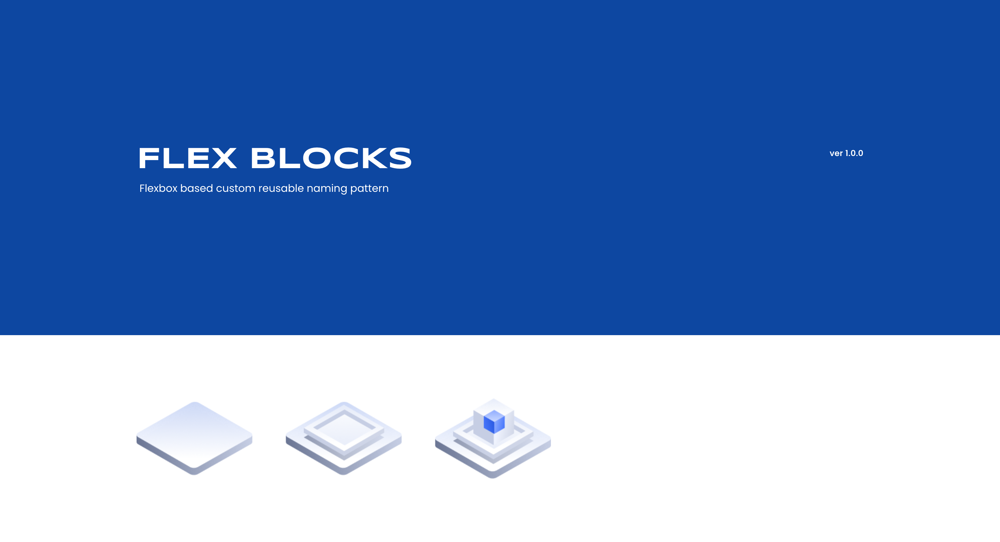

# Flex-blocks

reusable flexbox based naming pattern

```
npm install
npm run build
npm run start
```

<br/>

# Flex-block types

<br/>

## Parent


```
base wrapper
mid container
directional containers
positional containers
```

<br/>

```
.if-base-wrapper {
  position: relative;
  display: inline-flex;
  width: 100%;
}

.flex-mid-container {
  position: relative;
  display: flex;
  margin-left: auto;
  margin-right: auto;
  padding-left: 20px;
  padding-right: 20px;
  width: 100%;
}


<div class="if-base-wrapper">
  <div class="flex-mid-container max-w-75-perc">
   
  </div>
</div>
```

<br/>

## Child


```
content containers
flex items
```

<br/>

```
.if-content-panel {
  position: relative;
  display: inline-flex;
}

.flex-content-panel {
  position: relative;
  display: flex;
}


<div class="if-base-wrapper">
  <div class="flex-mid-container max-w-75-perc">
    <div class="horizontal-inline-flex">
      <div class="vertical-inline-flex">
        <div class="if-content-panel">

        </div>
        <div class="if-content-panel">

        </div>
      </div>
      <div class="vertical-inline-flex">
        <div class="if-content-panel">

        </div>
        <div class="if-content-panel">

        </div>
      </div>
    </div>
  </div>
</div>
```

<br/>

# Flex-block modifiers and utility classes

<br/>


```
display
flex-flow
justify-content modifiers
align-items modifiers
align-content modifiers
align-self modifiers
```

<br/>

```
margin
padding
width
height
border
background
```

<br/>

```
<div class="if-base-wrapper direction--column pad-all-20 border-1-white-75 bg-ffffff25 shadow-4">
  <div class="flex-mid-container direction--column max-w-75-perc pad-all-20 border-1-white-75">
    <div class="horizontal-inline-flex pad-all-20 border-1-white-75 bg-ffffff25 shadow-4">
      <div class="vertical-inline-flex pad-all-20 border-1-white-75 bg-ffffff25 shadow-4">
        <div class="if-content-panel w-100-perc pad-all-20 border-1-white-75 shadow-4 bg-ffffff25">

        </div>
        <div class="if-content-panel w-100-perc pad-all-20 border-1-white-75 shadow-4 bg-ffffff25">

        </div>
      </div>
      <div class="vertical-inline-flex pad-all-20 border-1-white-75 shadow-4 bg-ffffff25">
        <div class="if-content-panel pad-all-20 border-1-white-75 shadow-4 bg-ffffff25">

        </div>
        <div class="if-content-panel pad-all-20 border-1-white-75 shadow-4 bg-ffffff25">

        </div>
      </div>
    </div>
  </div>
</div>
```